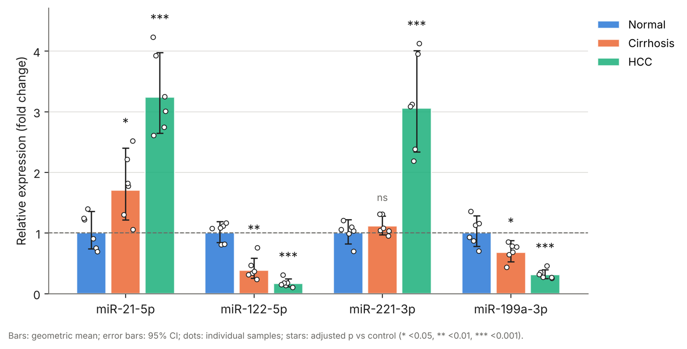
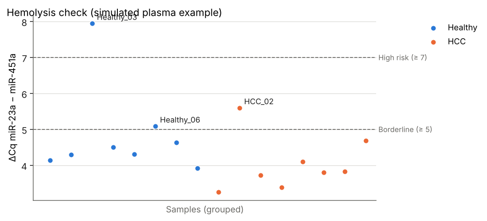

# qPCR Fold-Change Analyzer — built for miRNA research

Most labs still calculate ΔΔCt in Excel, where one wrong cell changes the result, and few check plasma samples for hemolysis before trusting a miRNA result. This web app takes raw Ct values, or the export file straight from your instrument, and returns quality checks, fold changes, statistics, a publication-ready figure and draft methods and results text in about a minute, without coding.

**Live app:** https://mirna-qpcr-analyzer.streamlit.app



## What makes it different

| Feature | Why it matters |
|---|---|
| **Hemolysis check** (miR-23a / miR-451a ΔCq) | Red blood cells release miR-451a and other miRNAs; hemolysed serum/plasma samples can create false biomarker results (Blondal et al., 2013) |
| **Spike-in recovery check** (e.g. cel-miR-39) | Flags samples where RNA extraction or reverse transcription failed |
| **Three normalisation strategies** | Reference genes (with geNorm stability ranking), exogenous spike-in, or global mean normalisation for miRNA panels (Mestdagh et al., 2009) |
| **Direct instrument import** | Reads QuantStudio / 7500 / StepOne and Bio-Rad CFX exports, skips header lines, removes NTC and standard wells, and guesses groups from sample names |
| **Draft results paragraph** | "miR-122-5p was significantly up-regulated in HCC compared with Healthy (7.49-fold, 95% CI 6.21–9.04; adjusted p < 0.001)…" |
| **Sample-size planner** | Replicates per group needed for your next study, based on the variability in your own data |



## Full feature list

- **Replicate QC:** flags high SD, late Ct, undetermined wells and single usable replicates; optional removal of the replicate furthest from the median
- **Sample exclusion:** exclude hemolysed or failed samples with one click; exclusions are recorded in the report
- **Relative quantification:** ΔCt, ΔΔCt and fold change, with optional per-assay amplification efficiencies (Hellemans et al., 2007). With 100 % efficiency this equals the 2^-ΔΔCt method (Livak & Schmittgen, 2001)
- **Statistics** on the log2 scale: Welch's t-test, Student's t-test, Dunnett's many-to-one test or Mann-Whitney U; Holm or Benjamini-Hochberg correction; one-way ANOVA / Kruskal-Wallis for three or more groups
- **Figure:** grouped bars (geometric mean, 95 % CI or SEM, individual samples, significance stars) as 300 dpi PNG, SVG or PDF
- **Report:** Excel workbook with every table, sample-quality results, settings, methods and results text
- **Efficiency calculator:** efficiency, slope and R² from a dilution series

## Validation

The calculation engine (`core.py`) is covered by **44 automated test cases** (`tests/test_core.py`), checked against:

- a hand-worked ΔΔCt example and an independent 2^-ΔΔCt implementation on the full example dataset
- the Pfaffl efficiency-corrected ratio, and exact recovery of a known 8-fold change despite different RNA input per sample
- a hand-calculated global mean normalisation
- R's `p.adjust` reference values (Holm, Benjamini-Hochberg) and SciPy's Welch, Student, Dunnett, Mann-Whitney and ANOVA results
- a line-by-line transcription of the geNorm M formula
- textbook sample-size values (Cohen's d = 1 → 17 per group; d = 0.5 → 64 per group)
- QuantStudio-style and Bio-Rad CFX-style export files
- two **simulated** example datasets with known true effects and planted problems (outlier replicate, undetermined well, hemolysed sample, failed extraction), all detected by the app

## Input

- **Instrument exports:** QuantStudio / 7500 / StepOne results (.txt, .csv, .xlsx) and Bio-Rad CFX *Quantification Cq Results* (.csv, .xlsx)
- **Your own table:** one row per well with Sample, Target and Ct/Cq, plus an optional Group column

| Sample | Group | Target | Ct |
|---|---|---|---|
| S1 | Control | miR-21-5p | 24.10 |
| S1 | Control | RNU48 | 25.02 |
| S2 | Treated | miR-21-5p | 22.31 |

## Run it yourself

```bash
pip install -r requirements.txt
streamlit run app.py
```

Run the tests:

```bash
pip install -r requirements-dev.txt
pytest -q
```

## Project structure

```
app.py                 Streamlit interface
core.py                All calculations (no UI code, fully tested)
plots.py               Figures
make_example_data.py   Generates the simulated example datasets
data/                  Example datasets, true values and input template
tests/test_core.py     Automated tests
```

## References

1. Livak KJ, Schmittgen TD. *Methods* 2001;25(4):402–408.
2. Hellemans J, et al. *Genome Biology* 2007;8(2):R19.
3. Vandesompele J, et al. *Genome Biology* 2002;3(7):research0034.
4. Mestdagh P, et al. *Genome Biology* 2009;10(6):R64.
5. Blondal T, et al. *Methods* 2013;59(1):S1–S6.
6. Dunnett CW. *J Am Stat Assoc* 1955;50(272):1096–1121.

## Author

**Tooba Mujtaba**, bioinformatician (MS/MPhil Bioinformatics), miRNA biomarker research.
For custom qPCR, miRNA or omics analysis, or a private analysis app for your lab: [LinkedIn](https://www.linkedin.com/in/tooba-mujtabaa247ba190)

MIT License.
